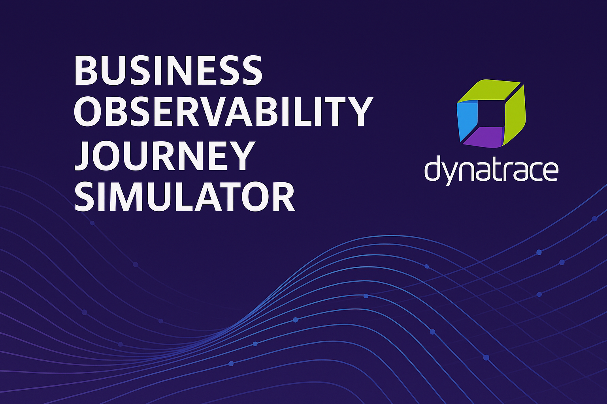

#  Dynatrace BizObs Journey Simulator

[](https://dynatrace-wwse.github.io/codespaces-framework/dynatrace-integration/#mcp-server-integration)
[](https://dynatrace-wwse.github.io/codespaces-framework/)
[](https://hub.docker.com/r/shinojosa/dt-enablement)
[](https://github.com/lawrobar90/Partner-PowerUp-BizObs-App/blob/main/LICENSE)
[](https://dynatrace-wwse.github.io/bizobs-journey-simulator)

---

<p align="center">

</p>

## 🚀 Complete Business Observability Solution

Transform your business observability with the **BizObs Journey Simulator** - a comprehensive platform for simulating, monitoring, and analyzing customer journeys with full Dynatrace integration.

This repository contains both the **application** and **comprehensive documentation** for implementing business observability in your organization.

## 📁 Repository Structure

```
bizobs-journey-simulator-wwse/
├── app/                    # Complete BizObs Journey Simulator Application
│   ├── server.js          # Main application server
│   ├── start-server.sh    # Complete startup script
│   ├── routes/            # API route handlers
│   ├── services/          # Business logic services
│   ├── public/            # Web interface
│   └── ...
├── docs/                  # Comprehensive Documentation
│   ├── index.md           # Documentation home
│   ├── 2-getting-started.md
│   ├── 3-concepts.md
│   └── ...
└── mkdocs.yaml           # Documentation configuration
```

## 🎯 Quick Start

### 📚 Read the Documentation
**[👨‍🏫 Complete Learning Guide](https://dynatrace-wwse.github.io/bizobs-journey-simulator)**

### 🚀 Run the Application
```bash
# Navigate to the application
cd app/

# Start the complete solution
./start-server.sh

# Or simple startup
npm install && npm start
```

### 🔧 Access Points
- **Application**: http://localhost:8080
- **Documentation**: https://dynatrace-wwse.github.io/bizobs-journey-simulator
- **Health Check**: http://localhost:8080/api/health

## 🎭 Key Features

- **🎪 Multi-Persona Support**: Karen (Retail), Raj (Insurance), Alex (Tech), Sophia (Enterprise)
- **📊 Real-Time Dashboards**: Live journey metrics and business KPI tracking
- **🔧 Dynamic Services**: Auto-scaling microservices architecture
- **🎯 Demo-Ready**: Pre-configured scenarios for customer demonstrations
- **🔍 Full Observability**: 13 Dynatrace metadata headers for complete traceability
- **⚡ Cloud-Native**: Runs in Codespaces, Kubernetes, or local environments

## 🌟 What's Included

### Application (`app/`)
- Complete Node.js application with Express.js
- Customer journey simulation engine
- Multi-persona behavior modeling
- Dynatrace integration middleware
- LoadRunner integration capabilities
- Error simulation and chaos engineering
- Real-time business metrics collection

### Documentation (`docs/`)
- **Getting Started**: Step-by-step setup guide
- **Core Concepts**: Business observability fundamentals  
- **Advanced Features**: Enterprise capabilities
- **Troubleshooting**: Comprehensive problem resolution
- **API Reference**: Complete API documentation
- **Demo Scripts**: Ready-to-use demonstration scenarios

## 🎓 Learning Path

1. **[📖 Read the Docs](https://dynatrace-wwse.github.io/bizobs-journey-simulator)** - Complete learning guide
2. **🚀 Setup Environment** - Follow the getting started guide
3. **🎭 Run Simulations** - Execute customer journey scenarios
4. **📊 Monitor Results** - Analyze in Dynatrace dashboards
5. **🔧 Customize** - Adapt for your business requirements

## 🤝 Support & Community

- **Documentation**: [Complete Guide](https://dynatrace-wwse.github.io/bizobs-journey-simulator)
- **Issues**: [GitHub Issues](https://github.com/lawrobar90/Partner-PowerUp-BizObs-App/issues)
- **Community**: [Dynatrace Community](https://community.dynatrace.com)

---

**Built for the Dynatrace Partner Power-Up Program**  
Demonstrating advanced business observability and distributed tracing capabilities.

