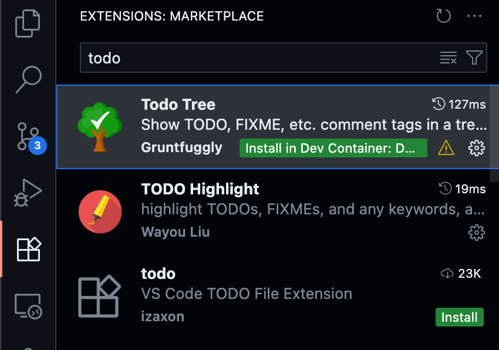

--8<-- "snippets/getting-started.js"
--8<-- "snippets/grail-requirements.md"

## 1. Prerequisites before launching the Codespace

TODO: Place the prerequisites and everything that is needed before launching the codespace. 

As a Professor we highly recommend to install VSCode locally and always open the devcontainer from it, specially since we'll be using some plugins for enhancing the productivity and your experience while building trainings. 

### 1.1 Download Visual Studio Code

- Go to  [https://code.visualstudio.com](https://code.visualstudio.com), download and install Visual Studio on your machine. 

!!! tip "Tipp"
    Working on a local Visual Studio Code, maximizes your productivity, you'll be able to connect to dev.containers remotely, locally, install plugins, and much more.

### 1.2 Install the TODO Tree VS Code extension. 

We'll be guiding you with TODOs to write your first hands-on trainig.
- Click on the extensions tab
- Search for "Todo tree"
- Click on it and install it

{: style="width: 400px;"}

Once installed, you'll see on the left menu bar, the Tree icon. When you click on it, a pane with TODO task will open, this tasks will guide you to write your training, remove each of them and the code or text that needs to be replace once completed. Like this page 😉. 

!!! tip "Let's launch the Codespace"
    Now we are ready to launch the Codespace! 

- [Let's launch Codespaces:octicons-arrow-right-24:](3-codespaces.md)

