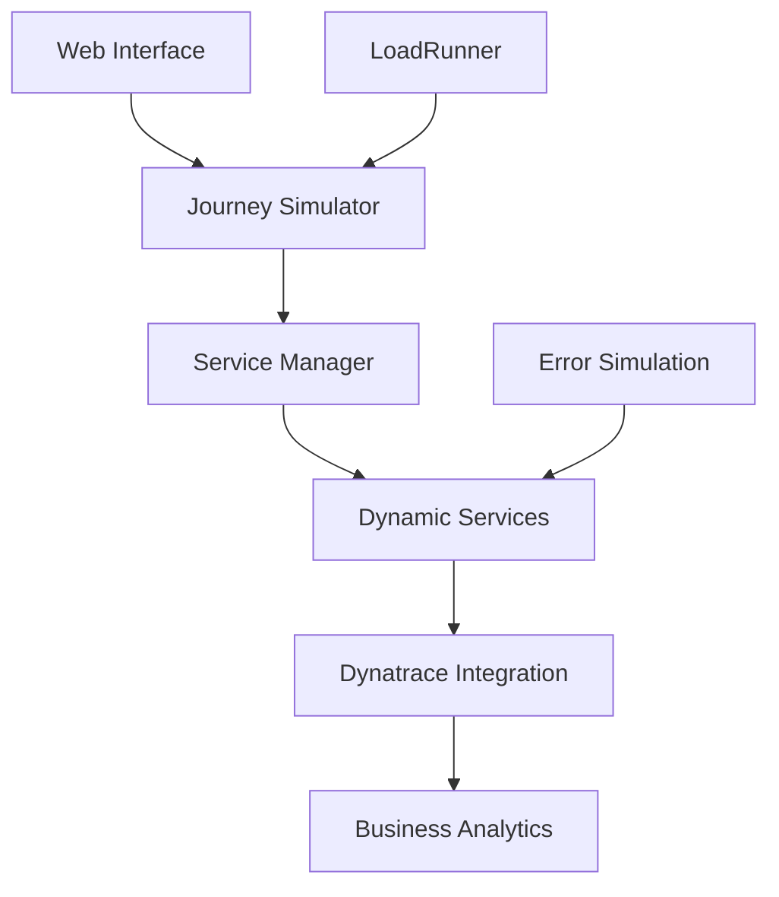

--8<-- "snippets/index.js"

--8<-- "snippets/disclaimer.md"

# Dynatrace BizObs Journey Simulator

Transform your business observability with the **BizObs Journey Simulator** - a comprehensive platform for simulating, monitoring, and analyzing customer journeys with full Dynatrace integration.

  

## 🎯 What You'll Learn

This hands-on enablement will guide you through:

- **Business Journey Simulation**: Create realistic multi-step customer journeys
- **Persona-Based Testing**: Implement different customer personas with unique behaviors
- **Dynatrace Integration**: Full observability with metadata injection and distributed tracing
- **Load Testing**: Integrate with LoadRunner for enterprise-grade performance testing
- **Real-Time Analytics**: Monitor business KPIs and journey success rates
- **Error Simulation**: Test resilience with configurable failure scenarios

## 🚀 Key Features

- **🎭 Multi-Persona Support**: Karen (Retail), Raj (Insurance), Alex (Tech), Sophia (Enterprise)
- **📊 Real-Time Dashboards**: Live journey metrics and business KPI tracking
- **🔧 Dynamic Services**: Auto-scaling microservices for realistic distributed architectures
- **🎯 Demo-Ready**: Pre-configured scenarios for customer demonstrations
- **🔍 Full Observability**: 13 Dynatrace metadata headers for complete traceability
- **⚡ Cloud-Native**: Runs in Codespaces, Kubernetes, or local environments

## 🏗️ Architecture Overview

## 📋 Prerequisites

- **Dynatrace Environment**: Access to a Dynatrace tenant
- **GitHub Account**: For Codespaces deployment
- **Basic Knowledge**: Understanding of business processes and customer journeys

## 🎓 Learning Path

### Beginner Level
1. [Getting Started](2-getting-started.md) - Set up your environment
2. [Core Concepts](3-concepts.md) - Understand business observability
3. [Lab 1: First Journey](4-lab1-first-journey.md) - Create your first simulation

### Intermediate Level
4. [Lab 2: Journey Monitoring](4-lab2-monitoring.md) - Set up monitoring and dashboards
5. [Lab 3: Data Analysis](4-lab3-analysis.md) - Analyze journey performance

### Advanced Level
6. [Custom Personas](5-advanced-personas.md) - Create custom customer personas
7. [LoadRunner Integration](5-advanced-loadrunner.md) - Enterprise load testing
8. [Error Simulation](5-advanced-errors.md) - Resilience testing

## 🌟 Demo Scenarios

### Insurance Journey
`PolicyDiscovery → QuoteGeneration → PolicySelection → PaymentProcessing → PolicyActivation → OngoingEngagement`

### E-Commerce Journey
`ProductBrowse → CartAddition → CheckoutProcess → PaymentValidation → OrderConfirmation → FulfillmentTracking`

### Banking Journey
`AccountInquiry → LoanApplication → CreditCheck → ApprovalProcess → DocumentGeneration → AccountSetup`

!!! tip "Ready to Transform Your Business Observability?"
    This simulator provides everything you need to demonstrate the power of business observability with Dynatrace. Each journey generates real business events, distributed traces, and actionable insights.

## 🎯 What's Included

- **Pre-built Journeys**: Insurance, retail, and banking scenarios
- **Customer Personas**: Realistic behavior patterns and preferences  
- **Monitoring Templates**: Ready-to-use dashboards and alerting
- **Integration Guides**: LoadRunner, Kubernetes, and CI/CD pipelines
- **Demo Scripts**: Complete scenarios for customer presentations

- [🚀 Let's get started! :octicons-arrow-right-24:](2-getting-started.md)

